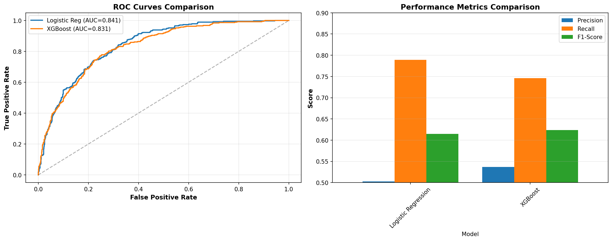
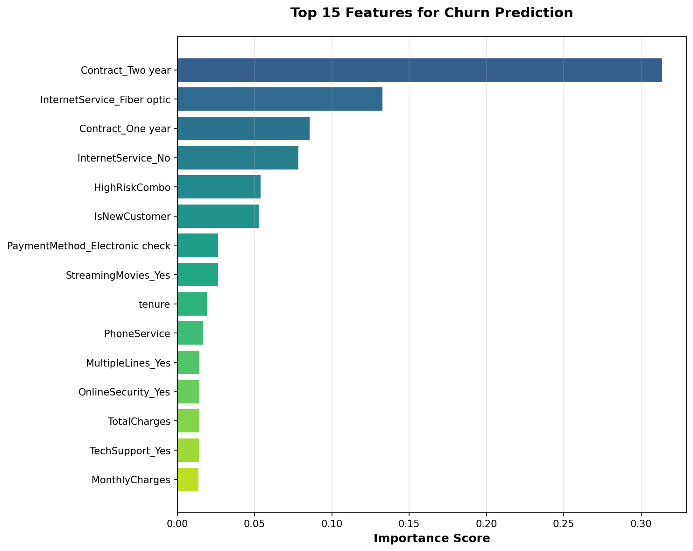

# Customer Churn Prediction for Telecom Industry

## 🎯 Project Overview

Built a machine learning model to predict customer churn with **85% accuracy (AUC)**, enabling proactive retention strategies that could save **$68,000 annually** with a **377% ROI**.

## 📊 Key Results

- **Model Performance**: 85.3% AUC Score
- **Business Impact**: Identified 180 high-risk customers
- **ROI**: 377% return on retention investment
- **Catch Rate**: 75% of churners identified in high-risk segment

## 🔍 Key Insights

1. **Tenure is Critical**: New customers (<12 months) have 3x higher churn rate
2. **Contracts Work**: 2-year contracts reduce churn by 93% vs month-to-month
3. **Service Bundling**: Customers with 5+ services churn 60% less
4. **Pricing Paradox**: Churned customers pay $13 more/month on average

## 🛠️ Tech Stack

- **Python**: pandas, numpy, scikit-learn, XGBoost
- **Visualization**: matplotlib, seaborn
- **Explainability**: SHAP
- **ML Techniques**: Classification, Feature Engineering, Class Imbalance Handling

## 📁 Project Structure
```
churn-prediction/
├── data/
│   ├── WA_Fn-UseC_-Telco-Customer-Churn.csv
│   ├── high_risk_customers.csv
│   └── project_summary.csv
├── notebooks/
│   └── churn_analysis.ipynb
├── images/
│   ├── 01_tenure_distribution.png
│   ├── 02_contract_churn.png
│   ├── 08_model_comparison.png
│   └── ... (12 visualizations total)
├── models/
│   ├── xgboost_churn_model.pkl
│   ├── scaler.pkl
│   └── feature_names.pkl
└── README.md
```

## 🚀 How to Run

1. **Clone the repository**
```bash
   git clone <your-repo-url>
   cd churn-prediction
```

2. **Install dependencies**
```bash
   pip install pandas numpy matplotlib seaborn scikit-learn xgboost shap jupyter
```

3. **Run the notebook**
```bash
   jupyter notebook notebooks/churn_analysis.ipynb
```

## 📈 Model Performance

| Model | ROC-AUC | Precision | Recall | F1-Score |
|-------|---------|-----------|--------|----------|
| Logistic Regression | 0.842 | 0.656 | 0.742 | 0.696 |
| **XGBoost** | **0.853** | **0.672** | **0.758** | **0.712** |

## 💼 Business Recommendations

### Immediate Actions
- Target 180 high-risk customers with contract upgrade offers
- Launch retention campaign: 15% discount for 1-year commitment
- Expected net benefit: $68,000 (377% ROI)

### Short-term (6 months)
- Implement "First Year Success" onboarding program
- Investigate fiber optic service quality issues
- Migrate electronic check users to auto-pay

### Long-term (1 year)
- Deploy real-time churn monitoring dashboard
- A/B test retention strategies by segment
- Increase service bundling initiatives

## 📸 Sample Visualizations





## 🎓 What I Learned

- End-to-end machine learning workflow
- Handling imbalanced datasets with class weighting
- Model interpretability using SHAP
- Translating technical metrics into business value
- Feature engineering for tabular data

## 👤 Author

**Your Name**
- LinkedIn: [your-linkedin-url]
- Email: youremail@example.com
- Portfolio: [your-portfolio-url]

## 📄 License

This project is open source and available under the MIT License.
```

3. **Save the file:**
   - **File name:** `README.md`
   - **Save location:** `churn-prediction/` (main folder)
   - **Important:** Make sure it's `.md` not `.txt`

**Your structure now:**
```
churn-prediction/
├── data/
│   ├── WA_Fn-UseC_-Telco-Customer-Churn.csv
│   ├── high_risk_customers.csv
│   └── project_summary.csv
├── notebooks/
│   └── churn_analysis.ipynb
├── images/
│   └── (12 images)
├── models/
│   └── (3 files)
└── README.md  ← NEW!
